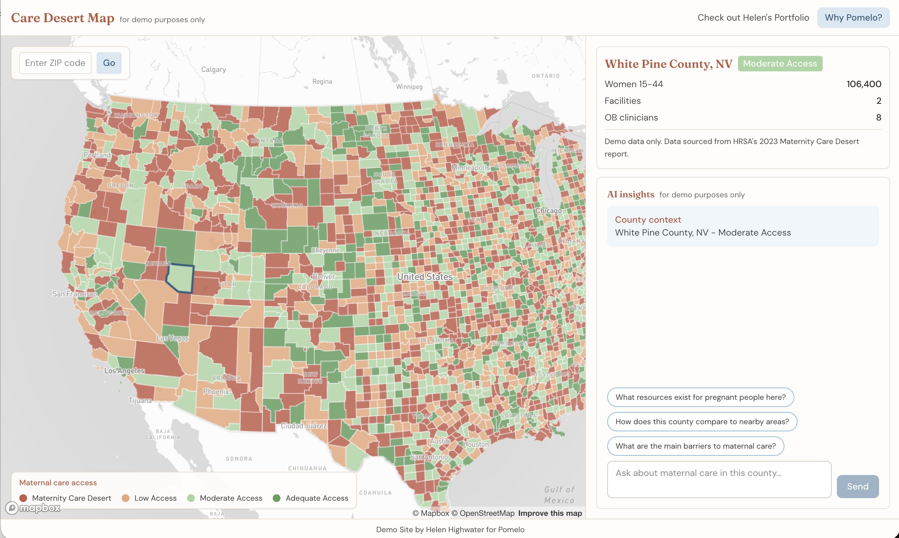

# Care Desert Map

An interactive map exploring maternal care access across the United States, county by county. Built as a demo project for my application to Pomelo Care.

Live demo: [your-demo-url.vercel.app](#)

---

## Why I built this

Pomelo is working on a genuinely interesting engineering problem. Their data engine ingests claims, lab, pharmacy, and EHR data and synthesizes it into real-time risk signals for clinicians, surfaced inside their internal care platform. Getting heterogeneous clinical data to actually change what a clinician does in the moment is hard to do well, and it's the kind of problem I want to work on.

Two of my sisters had complications during their births. Even with good hospital access it was scary, and I think about what that looks like for someone in one of the counties on this map.

I built this to understand the problem at a data level, and to stand out as an applicant.

---

## What it does

- Renders a choropleth map of every US county colored by maternal care access level (desert, low, moderate, adequate) using data extracted from HRSA's AHRF CSV files (temporary placeholder; March of Dimes data requested)
- Detects your location on load and zooms to your county
- Click any county to see its stats in the side panel
- Ask questions about that county through an AI chat interface powered by Claude

---


## Stack

- **Next.js 14** (App Router)
- **React** + **Tailwind CSS**
- **Mapbox GL JS**
- **Anthropic Claude API** (server-side)
- Deploy to **Vercel**

## Setup

1. **Install dependencies**

   ```bash
   npm install
   ```

2. **Environment variables**

   Copy `.env.example` to `.env.local` and fill in:

   - `NEXT_PUBLIC_MAPBOX_TOKEN` - Mapbox access token ([get one](https://account.mapbox.com/))
   - `ANTHROPIC_API_KEY` - Anthropic API key for AI chat

3. **Run locally**

   ```bash
   npm run dev
   ```

4. **Build for production**

   ```bash
   npm run build
   npm start
   ```

## Project structure

```
src/
├── app/                 # Next.js App Router
│   ├── api/chat/        # Claude API route (server-side only)
│   ├── layout.tsx
│   ├── page.tsx
│   └── globals.css
├── components/          # UI components
│   ├── Map.tsx          # Mapbox choropleth + geolocation
│   ├── MapLegend.tsx
│   ├── CountyPanel.tsx  # County stats + AI chat
│   ├── AIChat.tsx       # Chat logic and UI
│   ├── Header.tsx
│   └── WhyPomeloModal.tsx
├── data/                # Data layer
│   ├── constants.ts     # Access levels, colors, layout
│   ├── types.ts
│   └── countyAccessData.ts
└── lib/                 # Utilities
    ├── mapUtils.ts
    └── stateCodes.ts
```

## Deployment (Vercel)

1. Push the repo to GitHub.
2. Import the project in [Vercel](https://vercel.com).
3. Add `NEXT_PUBLIC_MAPBOX_TOKEN` and `ANTHROPIC_API_KEY` in project settings.
4. Deploy.

--

## Data source

County-level maternal care access data was extracted from HRSA's [Area Health Resources Files (AHRF)](https://data.hrsa.gov/) CSV files. Limitations include: not population-adjusted, missing some provider types (e.g., family physicians who deliver, certified professional midwives), and other edge cases. I've requested data from March of Dimes, which uses a more rigorous methodology - this is a temporary placeholder. Counties are classified as a maternity care desert, low access, moderate access, or adequate access based on OB clinicians and birthing facilities. Figures should be treated as directional, not precise.

---

## About the AI chat

This chat is a demo implementation. I want to be honest about what it is and is not.

It is not clinically validated. Responses are generated by a general-purpose language model supplemented with county-level data extracted from HRSA's AHRF CSV files (temporary placeholder; March of Dimes data requested). The model has no connection to verified provider directories and can confidently state incorrect facility names, drive times, or program details.

It is not designed for someone in crisis. There is basic redirect logic for distress signals, but no real crisis detection, no clinician in the loop, and no escalation path. A pregnant person in a rural care desert who is scared and looking for help deserves better than a chatbot.

It is not built for personal health data. HIPAA applies when identifiable health information is collected or transmitted. This app does not ask for it, but a real implementation would need clear guardrails to prevent users from entering it, and compliant infrastructure if they do.

A real version would need:
- RAG grounded in a verified, regularly updated provider and facility directory
- Structured output validation to catch hallucinations before they reach a user
- Clinical governance over system prompt design and guardrails
- Real crisis detection and warm handoff to human support
- HIPAA-compliant infrastructure throughout

The distance between this demo and something safe enough to put in front of a pregnant person navigating a care desert is large. I know that. I built this to show I understand the problem, technically and humanly, and because I want to help close that distance.

---

## About me

I'm Helen Highwater, a junior software engineer with a non-traditional background looking for the right place to grow. This felt like meaningful work worth getting good at.

[heyimhelen.com](https://heyimhelen.com) - [LinkedIn](https://www.linkedin.com/in/helen-highwater-96981532/) 